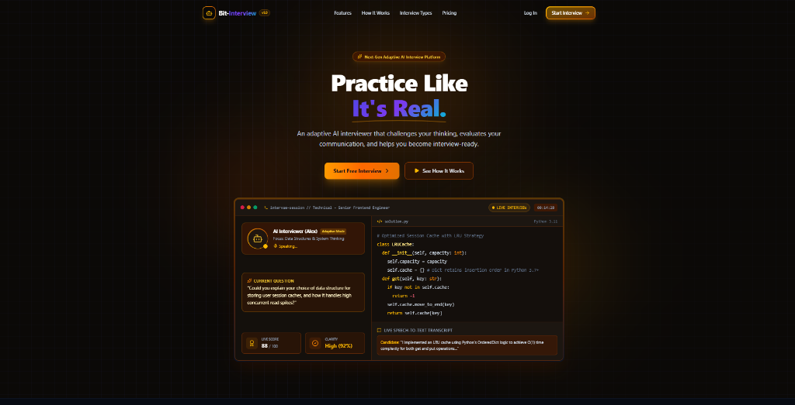
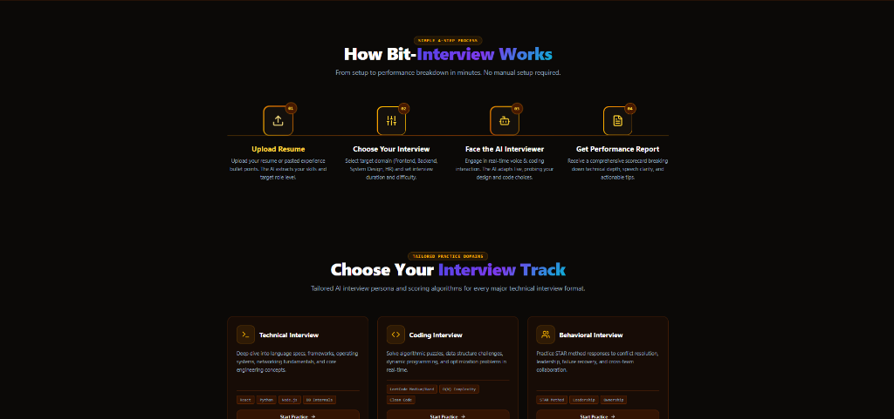
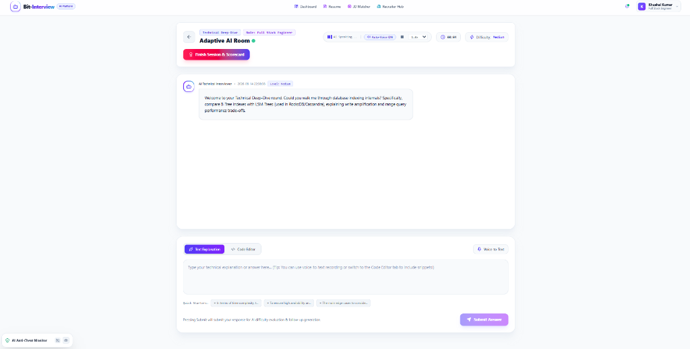
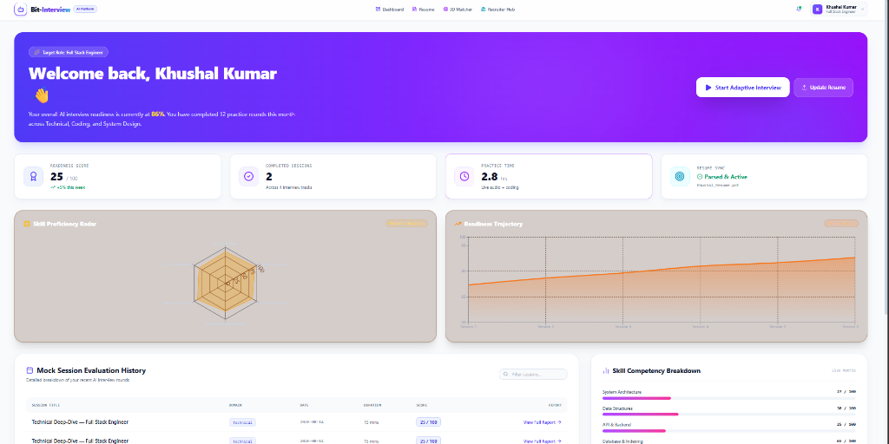
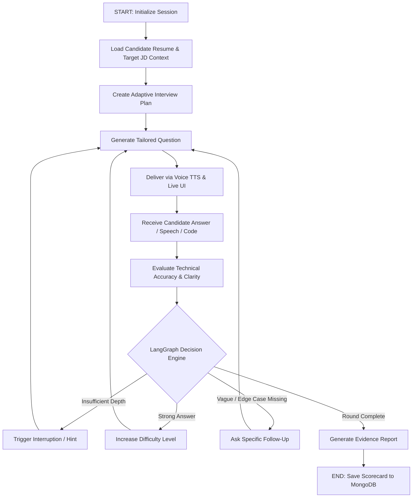

<div align="center">

# ⚡ Bit-Interview — Next-Gen AI Technical Interview Simulator

### *"Practice like it's real."*

[](https://react.dev/)
[](https://vitejs.dev/)
[](https://tailwindcss.com/)
[](https://fastapi.tiangolo.com/)
[](https://langchain.com)
[](https://python.org)
[](https://www.mongodb.com/)
[](https://redis.io/)

*An production-grade, stateful AI interview platform featuring adaptive LangGraph agent workflows, real-time voice interaction, Monaco coding sandbox with Judge0 execution, PDF resume extraction, ATS Job Description matching, and proctored session analytics.*

</div>

---

## 📸 Product Interface Showcase

<div align="center">

### 1️⃣ Next-Gen AI Landing & Product Showcase


### 2️⃣ Tailored Practice Tracks & 4-Step Process


### 3️⃣ Adaptive AI Room — Voice Narration, Monaco Code Editor & Anti-Cheat Monitor


### 4️⃣ Candidate Analytics & Readiness Trajectory Dashboard


</div>

---

## 🛠️ Complete Technical Architecture

| Layer | Technology | Purpose & Implementation |
| :--- | :--- | :--- |
| **Frontend Framework** | `React 19` + `Vite 8` | High-performance SPA with fast hot-module replacement |
| **Styling & Design System** | `Tailwind CSS 4` | Custom Light Mode design system with Indigo/Violet gradients |
| **Animations** | `Framer Motion` | Micro-interactions, slide transitions, and glowing badges |
| **Iconography** | `Lucide React` | Clean, modern SVG UI icons |
| **Routing** | `React Router 6` | Client-side view router with protected user session guards |
| **Analytics Charts** | `Recharts` | Skill Proficiency Radar & Readiness Trajectory graphs |
| **In-Browser IDE** | `Monaco Editor` | VS-Code powered code editor for live coding rounds |
| **Backend Framework** | `Python 3.11` + `FastAPI` | Asynchronous high-throughput REST API & WebSockets server |
| **AI Agent Orchestration** | `LangGraph` + `LangChain` | Stateful adaptive interviewer workflow DAG & decision engine |
| **LLM Engine** | `Gemini 2.5 Pro` / `OpenAI` | Question generation, code evaluation, & evidence feedback |
| **NLP Processing** | `HuggingFace Transformers` | Text classification & semantic response evaluation |
| **Embeddings** | `Sentence Transformers` | Semantic similarity matching between Resume and JD |
| **Machine Learning Analytics** | `Scikit-learn` | Candidate readiness trajectory scoring & anomaly analytics |
| **Primary Database** | `MongoDB` / `MongoDB Atlas` | Persistence for Users, Resumes, Sessions, Reports & Transcripts |
| **Database Driver** | `PyMongo` / `Motor` | Async Python database driver for high concurrency |
| **Session Cache** | `Redis` / `Redis Cloud` | Sub-millisecond live interview buffer & WebSocket state cache |
| **Real-time Engine** | `WebSockets` / `Socket.IO` | Low-latency live interview streaming events |
| **Speech Input** | `Web Speech API` → `Whisper` | Speech-to-text transcript generation with voice activity |
| **Voice Output** | `SpeechSynthesis` → `TTS Provider` | Natural AI voice question narration with speed selector |
| **Code Execution Sandbox** | `Judge0` | Isolated remote execution engine for Python, JS, C++, Java |
| **Document Intelligence** | `PyMuPDF (fitz)` | Layout-aware PDF resume text and structure parser |
| **Authentication & Security** | `JWT` + `Passlib (bcrypt)` | Secure token session handling and password hashing |
| **API Client** | `Axios` | Intercepted HTTP request client for REST endpoints |

---

## 🏗️ System Architecture Diagram

```text
                               +-----------------------------------+
                               |       React 19 + Vite Frontend    |
                               | (Monaco IDE, Speech, Recharts UI) |
                               +-----------------------------------+
                                                 |
                                     REST APIs / WebSockets
                                                 |
                                                 v
                               +-----------------------------------+
                               |       FastAPI Async Gateway       |
                               |    (Authentication & Gateways)    |
                               +-----------------------------------+
                                    /            |            \
                                   /             |             \
                                  v              v              v
      +-------------------------------+   +-------------+   +-------------------+
      |      LangGraph AI Engine      |   |   Judge0    |   | PyMuPDF Document  |
      |  (Stateful Adaptive Agent)    |   | Execution   |   | PDF Resume Parser |
      +-------------------------------+   +-------------+   +-------------------+
          /          |          \                |                    |
         v           v           v               v                    v
  +-----------+ +--------+ +-----------+   +-----------+    +-------------------+
  | Question  | | Eval   | |  Decision |   | Sandboxed |    | Candidate Profile |
  |   Agent   | | Agent  | |   Engine  |   | Code Run  |    |  & Skill Cloud    |
  +-----------+ +--------+ +-----------+   +-----------+    +-------------------+
        \            |           /               
         +-----------+-----------+               
                     |                           
                     v                           
           +--------------------+                
           | Redis Live State   |                
           |  Session Buffer    |                
           +--------------------+                
                     |                           
                     v                           
        +--------------------------+             
        |  MongoDB Atlas Database  |             
        +--------------------------+             
```

---

## 🧠 LangGraph Adaptive Interview Workflow

`Bit-Interview` uses a stateful **LangGraph Agent Network** to ensure the interviewer acts as an experienced lead engineer rather than a simple Q&A bot.



### 🎯 Adaptive Decision Signals
1. **Silence / Delay Interruption**: Triggers *"Would you like to walk me through your current thinking?"* when candidate stays silent.
2. **Rambling Interruption**: Triggers concise redirection when candidate response exceeds optimal brevity thresholds.
3. **Vague Answer Challenge**: Identifies missing edge cases or hand-waving and requests concrete code/architectural trade-offs.

---

## 🌟 Core Features & Modules

### 🎙️ 1. Adaptive AI Live Room
* **Real-Time Voice Narration**: Auto-voice readout with customizable speed selector (0.85x - 1.5x) and Speech-to-Text transcript recorder.
* **Monaco Editor Integration**: In-browser coding environment supporting JavaScript, Python, C++, and Go with instant execution feedback via Judge0.
* **Dynamic Difficulty Scaling**: Live difficulty meter tracking real-time difficulty levels (`Easy` → `Medium` → `Hard` → `Advanced`).

### 📄 2. Resume Intelligence Hub
* **PyMuPDF Extraction**: Extracts structured skills, project portfolios, work experience, and educational background from PDF uploads.
* **Context-Aware Interviewing**: AI asks deep-dive questions targeting actual projects, frameworks, and architecture choices listed on candidate's resume.

### 🎯 3. ATS Job Description Matcher
* **Semantic Resume-to-JD Matching**: Compares candidate background with target company JDs (e.g. Stripe, Vercel, Meta) using Sentence Transformers.
* **ATS Resume Bullet Generator**: Generates high-impact accomplishment bullets tailored for applicant tracking systems.

### 🛡️ 4. AI Anti-Cheat & Proctoring Engine
* **Browser Integrity Monitoring**: Logs tab switches, window blur events, and focus loss during live sessions.
* **Webcam Proctoring**: Optional video preview calculating a real-time **Session Integrity Score %**.

### 📊 5. Comprehensive Diagnostic Reports
* **Category Breakdown**: Evaluates Technical Depth, Coding Accuracy, Problem Solving, Communication, and System Architecture.
* **Evidence-Based Feedback**: Links actionable recommendations directly to transcript timestamps.
* **7-Day Technical Study Roadmap**: Customized daily plan to strengthen detected skill gaps.

### 💼 6. Employer & Recruiter Portal
* **Candidate Leaderboard**: Rank applicants across tracks with integrity flags and diagnostic scorecards.
* **Talent Pipeline Tracker**: Manage candidates by active Job Description assessments.

---

## 📁 Project Directory Structure

```text
interview/
├── README.md                           # Master Project Documentation
└── intervue-ai/
    ├── docs/
    │   └── images/                     # Screenshots & Diagrams
    │       ├── landing_hero.png
    │       ├── how_it_works_tracks.png
    │       ├── adaptive_ai_room.png
    │       └── dashboard_analytics.png
    │
    ├── frontend/                       # React 19 + Vite Frontend
    │   ├── src/
    │   │   ├── components/
    │   │   │   ├── DashboardNavbar.jsx         # Frosted Light Mode Navbar
    │   │   │   ├── VoiceInterviewerControls.jsx# Speech-to-Text & Narration
    │   │   │   ├── MonacoCodeEditor.jsx        # In-browser Code IDE
    │   │   │   ├── ProctoringWidget.jsx        # Anti-Cheat Audit Monitor
    │   │   │   └── AnalyticsCharts.jsx         # Radar & Trajectory Visualizers
    │   │   ├── pages/
    │   │   │   ├── DashboardPage.jsx           # Candidate Control Center
    │   │   │   ├── InterviewPage.jsx           # Live Adaptive AI Room
    │   │   │   ├── ResumePage.jsx              # Resume Intelligence Hub
    │   │   │   ├── JDAnalyzerPage.jsx          # ATS Resume & JD Matcher
    │   │   │   ├── InterviewReportPage.jsx     # Diagnostic Scorecard Report
    │   │   │   └── RecruiterDashboardPage.jsx  # Employer Leaderboard
    │   │   ├── index.css                       # Tailwind Design System Tokens
    │   │   └── App.jsx                         # Main Router Setup
    │   └── package.json
    │
    └── backend/                        # FastAPI + LangGraph Backend
        ├── app/
        │   ├── main.py                     # API Application Entrypoint
        │   ├── routes/                     # Interview, Resume, JD & Recruiter Endpoints
        │   ├── services/                   # LangGraph Agent, PyMuPDF & LLM Services
        │   ├── core/                       # Security, JWT & Config Setup
        │   └── models/                     # MongoDB Pydantic Data Models
        ├── requirements.txt
        └── .env.example
```

---

## ⚡ Local Setup & Installation

### Prerequisites
* **Node.js**: v18+
* **Python**: v3.11+
* **MongoDB**: Local instance or MongoDB Atlas URI
* **Redis**: Local server or Redis Cloud instance

### 1. Environment Configuration
Create `backend/.env` file:
```env
MONGODB_URI=mongodb+srv://<username>:<password>@cluster0.mongodb.net/bit_interview
JWT_SECRET=your_super_secret_jwt_key_here
REDIS_URL=redis://localhost:6379
GEMINI_API_KEY=your_gemini_api_key_here
OPENAI_API_KEY=your_openai_api_key_here
JUDGE0_URL=https://judge0-ce.p.rapidapi.com
CORS_ORIGIN=http://localhost:5173
```

### 2. Backend Installation & Launch
```bash
cd intervue-ai/backend

# Create virtual environment
python -m venv venv

# Activate virtual environment
# Windows:
.\venv\Scripts\activate
# Linux/macOS:
source venv/bin/activate

# Install dependencies
pip install -r requirements.txt

# Start FastAPI server
uvicorn app.main:app --reload --port 8000
```
Backend API will be running live at `http://localhost:8000`.

### 3. Frontend Installation & Launch
```bash
cd intervue-ai/frontend

# Install dependencies
npm install

# Start Vite dev server
npm run dev
```
Frontend Web Application will be live at `http://localhost:5173`.

---

## 📄 License & Attribution

Distributed under the MIT License. See `LICENSE` for more information.

<div align="center">
  <sub>Built with ❤️ by <strong>Khushal Kumar</strong> • Powered by LangGraph, FastAPI, React 19 & Gemini AI</sub>
</div>
